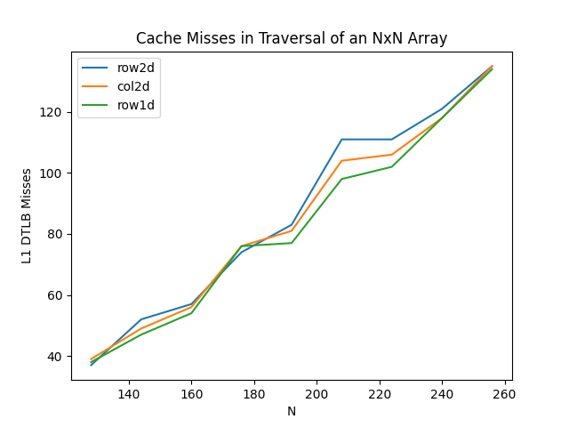
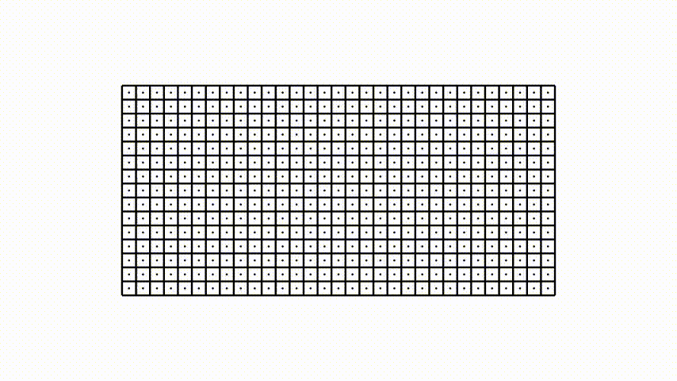

# Simple Cache Filling Performance on 2d Arrays

This app computes the average of a 2d array and implements 3 different methods of doing so. Running this project depends on the gen_data micro app which will generate a 2d array of doubles of arbitrary size. While that app itself contains multiple implementations of a 2d matrix, we are using a 1 dimensional array prepended with row pointers in order to show the highest performance you can achieve if filling your cache correctly.

~~~
make MAX_DIM=MATRIX_AXIS_LENGTH
~~~
ex.
~~~
make MAX_DIM=128
~~~

### Analysis

Before we run any code, these are the functions in the `arr_avg.c` file we are interested in examining:
- `avg_1d` - computes the average of the array and never uses the row pointers for indexing (`arr[start_idx + idx++]`)
- `avg_2d_row` - computes the average of the array by traversing by row (`arr[i][j]`)
- `avg_2d_col` - computes the average of the array by traversing by column (`arr[j][i]`)

Since C arrays are stored in row major order we can guess that out of `avg_2d_row` and `avg_2d_col`, the function traversing the row will maintain the spatial locality needed to reuse loaded cache values. For every value read, 8 doubles will be loaded into the cache (assuming 64 byte cache lines and 8 byte double size), so with a NxN matrix, the next value in the cache won't be used until another N iterations of the loop, the 3rd byte won't be used until 2 * N more iterations of the loop, and so on. Let us examine this phenomenon with various matrix sizes.

#### N = 64
With a 16x16 matrix, let us run the executable.
~~~
$ make MAX_DIM=64
$ sudo likwid-perfctr -C S0:0 -g TLB_DATA -m ./arr_avg_bin
~~~
Because we know that C stores arrays in row major order, we know that accessing elements of the array using the `avg_2d_row` and `avg_1d` methods should be faster than the `avg_2d_col` method. However, when we see the results of likwid, we see that the `col2d` marker section actually had less L1 DTLB load misses than the `row2d` section. 

~~~
Region row2d, Group 1: TLB_DATA
L1 DTLB load misses        |           13
+-----------------------------------+--------------+
Region col2d, Group 1: TLB_DATA
L1 DTLB load misses        |           11
+-----------------------------------+--------------+
Region row1d, Group 1: TLB_DATA
L1 DTLB load misses        |           11
~~~

Why is this? 

Between runs, we are repeatedly writing to 8MB of memory (1,000,000 doubles written to 256 times) in order to clear the cache (128K L1 Data cache). Obviously clearing the cache this way is just theoretical, but even if we reorder the methods, we get the same results. Between runs, we may see some differences where the number of misses for `row2d` will be less than the number of misses for `col2d`, but the main takeaway is that the difference isn't significant enough to claim that `row2d` has less cache misses than `col2d`. 

My machine has a 4 x 32K L1 Data cache, so it might have crossed your mind that the `avg_2d_col` method performs the same as `avg_2d_row` because the cache isn't even being thrashed. If the If we calculate the size of our matrix of doubles, we see that the total size is
~~~
8 [sizeof(double)] * 64 [x_dim] * 64 [y_dim] = 32768 bytes
~~~
So a 64x64 matrix of doubles perfectly fits in our core's L1 cache! Still note that this 32K region is shared across 2 threads, so we don't really expect the entire thing to actually be in the cache. But the majority of it being in the cache is the reason that we see no performance differences between `avg_2d_row` and `avg_2d_col`.

So let's try increasing our N. We know that an array with dimensions greater than 64x64 will no longer fit in our L1 cache, so let us graph the number of misses for each method as we increase N.

#### N = 128-256

	

<!---->

The image shows that we still don't have a discernible difference in L1 cache misses between the 3 methods used. We know that the array is larger than the 32K our core has allocated to the L1 cache, but why isn't the `avg_2d_col` method showing more cache misses than our other 2 implementations?

The reason is that our `avg_2d_col` method still takes advantage of spatial locality. The below animation shows how our array is being loaded into the cache. When we reach the last row of the matrix in our column traversal, we've only read `nrows * 8` values into the cache before we read a value in row 0 again. 

	

<!---->
